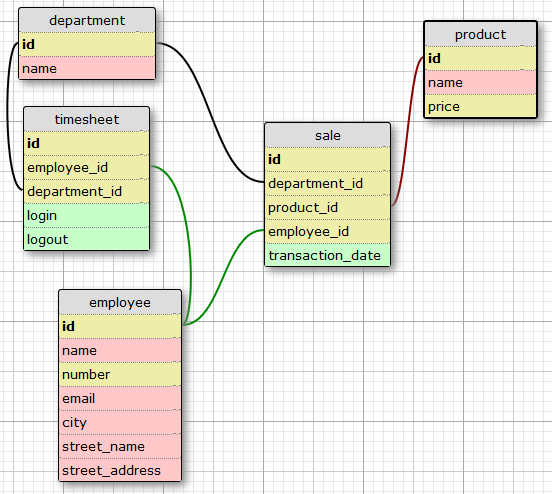

# [SQL Bug Fixing: Fix the QUERY - Totaling](https://www.codewars.com/kata/582cba7d3be8ce3a8300007c)

Oh no! Timmys been moved into the database divison of his software company but, as we
know, Timmy loves making mistakes. Help Timmy keep his job by fixing his query...

Timmy works for a statistical analysis company and has been given a task of totaling the
number of sales on a given day grouped by each department name and then each day.

### Tables and relationship

### Resultant table

- `day` (type: `date`) `{group by}` `[order by asc]`
- `department` (type: `text`) `{group by}` (in a real world situation it is bad practice to name a column after a table)
- `sale_count` (type: `int`)
